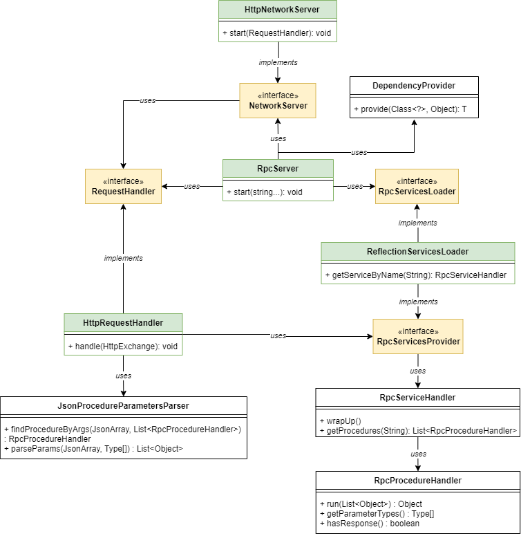

# Rozsa RPC
Simple java HTTP-based RPC library.

## Features

- Invoked by HTTP GET/POST requests;
- Simple annotations usage:
  - @RpcService mark classes to be used in RPC;
  - @RpcProcedure mark methods to be called as procedures;
- Simple setup (just set target service's packages);
- Avoid runtime overhead by pre-caching all necessary reflection data at startup;
- Allow data structures usage (Array, List, Map, etc);
- Allow procedure overloading;
- Allow to use custom procedure names (instead of the method name)
- Allow transport, parsing and service loading logic to be overwritten by using a dependency provider.

## Usage

Having a properly annotated service:

```Java
package com.rozsa.services.calc;

import com.rozsa.rpc.annotations.RpcProcedure;
import com.rozsa.rpc.annotations.RpcService;

@RpcService("calc")
public class Calculator {

    @RpcProcedure
    public int sum(int a, int b) {
        return a + b;
    }

    // It is possible to use an alias instead of the method name.
    @RpcProcedure("sub")
    public int subtraction(int a, int b) {
        return a - b;
    }

    // Use collection types as parameters.
    @RpcProcedure
    public List<Integer> sum(List<Integer> a, Integer b) {
      List<Integer> result = new ArrayList<>();
      for (Integer integer : a) {
        Integer sum = integer + b;
        result.add(sum);
      }
  
      return result;
    }

    @RpcProcedure
    public void printPi() {
        System.out.println(Math.PI);
    }
    
    // Won't be available as a procedure because it's not annotated with @RpcProcedure
    public double getPi() {
        return Math.PI;
    }
}
```

The server may be configured as follows:

```Java
package com.rozsa;

import com.rozsa.rpc.RpcServer;
import java.lang.reflect.InvocationTargetException;

public class Main {
    public static void main(String[] args) throws NoSuchMethodException, InstantiationException, IllegalAccessException, InvocationTargetException {
        RpcServer rpc = new RpcServer(8000);
        rpc.start("com.rozsa.services");
        System.out.println("Server is running!");
    }
}
```

Invoke "calc" service as:

- Request: ``GET http://localhost/calc/sum/10/20``
- Response: ``HTTP 200 - JSON response content: 30``


- Request: ``GET http://localhost/calc/sub/10/20``
- Response: ``HTTP 200 - JSON response content: -10``


- Request: ``POST http://localhost/calc/sum - JSON body content: [ [ 1, 2, 3, 4], 10 ]``
- Response: ``HTTP 200 - JSON response content: [ 11, 12, 13, 14 ]``


- Request: ``GET http://localhost/calc/printPi``
- Response: ``HTTP 204 - no response content``

## GET Requests

Use <b>GET</b> for lightweight requests. Procedures called by GET have their arguments (if any) encoded in the URI (as
path variables). For instance, the following procedure:
```Java
// invoked by using GET /serviceName/procedureName/param1/param2
@RpcProcedure
public List<Post> read(String input, int count);
```

May be invoked by using ``http://localhost/serviceName/read/dummyText/123/``. The downside is that it only supports
Primitive types as arguments.

## POST Requests

Use <b>POST</b> when it's necessary to transfer larger data payloads. When using POST, the URI arguments won't be used
and the procedure arguments will be retrieved from the request body. For instance:
```Java
// invoked by using POST /serviceName/procedureName
@RpcProcedure
public void createAll(List<Post> post, Date createdAt);
```

May be invoked by using ``http://localhost/serviceName/createAll`` with the following request body:
```JSON
[
    [
        {
            "text": "My first blog post",
            "author": "Vitor Rozsa",
            "stars": 5
        },
        {
            "text": "My second blog post",
            "author": "Rozsa RPC",
            "stars": 5
        }
    ],
    "2021-02-15T11:40:15.1234-03:00"
]
```

It is also possible to use POST (instead of GET) to invoke procedures that require only primitive arguments. The
arguments will be retrieved from the request body.

## Procedure Overloading

Procedures accept primitive (boxed and unboxed) and data-structure types. Overloads are allowed  with the following
conditions:

- Procedures with a different count of parameters;
- Procedures with the same count of parameters, but with differentiable data types.

Parameters parsing differentiate between <b>Primitives, Objects and Arrays</b> types. *Those may not correspond exactly
to OO primitives and arrays, but they are a *JSON-based view*.

- <b>Primitives</b>: Date, Double, Float, Long, Integer, Short, Character, Byte, Boolean, String and all their unboxed
  counterparts;
- <b>Arrays</b>: Array, List, Collection, Queue, Deque and Set;
- <b>Objects</b>: Maps and any other types that aren't in the Primitives nor Arrays types list.

When two or more procedures have the same signature and parameters count, the one who matches the received arguments
list will be selected. For instance:

```Java

// Matching args would be: [ PRIMITIVE ]
public Book getBooks(int count);

// Matching args would be: [ ARRAY ]
public Book getBooks(List<Integer> ids);

// Matching args would be: [ PRIMITIVE, ARRAY ]
public Book getBooks(int count, List<Integer> filter);

// Matching args would be: [ ARRAY, PRIMITIVE ]
public Book addBooks(List<String> names, String author);

// Matching args would be: [ OBJECT, PRIMITIVE ]
public Book addBooks(Map<String, String> relation, int publishingDate);
```

The selector will translate the received arguments only to the types listed above. So, two procedures, say
`readBook(List<Integer> ids)` and `readBook(Collection<Integer> ids)` won't be distinguishable.

Also, null arguments are permitted and will be matched with any of the available types (only if is still possible to
find the target procedure).


### Expected Date Format

```Json
"yyyy-MM-dd'T'HH:mm:ss.SSSZ"
```

For instance: ``2021-02-15T11:40:15.1234-03:00``

## Class Diagram
- Green are core classes;
- Yellow are core interfaces (mostly overwrite-able);
- White are auxiliary classes.



## TODO

- Add client API builder
  - Add Sync and Async method calls
  - Add reactive APIs
- Add examples on how to overwrite the logic.
